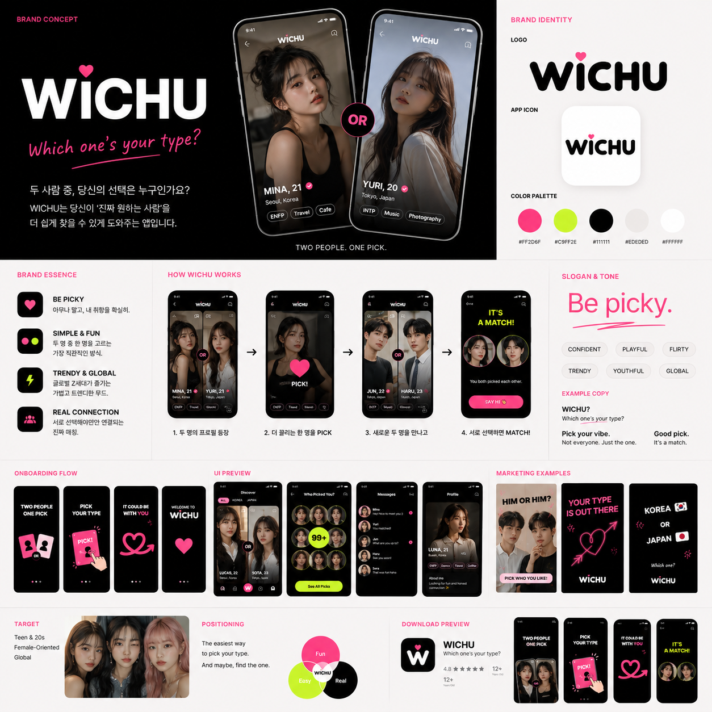

# WICHU



WICHU는 18세 이상 사용자를 위한 글로벌 소셜 디스커버리 앱입니다. 핵심 브랜드 문장은 **Which one’s your type?**, 제품 행동 언어는 **Pick**입니다. 웹 래핑 없이 Expo/React Native 기반 iOS·Android 네이티브 앱으로 개발합니다.

## 현재 상태

- Expo SDK 57 + Expo Router + TypeScript 실행 구조
- Discover / Matches / Chat / Me 탭과 상세 라우트
- 브랜드 테마, 앱 아이콘, 네이티브 스플래시
- mock 프로필 Swipe/Pick 카드, 다음 이미지 prefetch, Zustand 상태
- Supabase 클라이언트·서비스 경계와 초기 migration
- TanStack Query, i18n, ESLint, Prettier

Discover는 한 화면에 한 명의 프로필을 보여주고 Like/Pass로 넘기는 **1카드 Swipe** 방식입니다. 현재 mock deck도 같은 상호작용과 다음 이미지 prefetch 구조를 사용합니다.

## 실행

```bash
cp .env.example .env.local
npm install
npm start
```

검증:

```bash
npm run typecheck
npm run lint
npm run format:check
```

`.env.local`에는 클라이언트 공개용 Supabase URL과 publishable key만 둡니다. `service_role` 또는 secret key는 앱에 포함하지 않습니다.

## 문서

- [제품 범위](docs/PRODUCT.md)
- [브랜드 시스템](docs/BRAND.md)
- [아키텍처](docs/ARCHITECTURE.md)
- [데이터베이스](docs/DATABASE.md)
- [운영 기준](docs/OPERATIONS.md)
- [릴리스 기준](docs/RELEASE.md)
- [개발 우선순위](docs/TODO.md)
